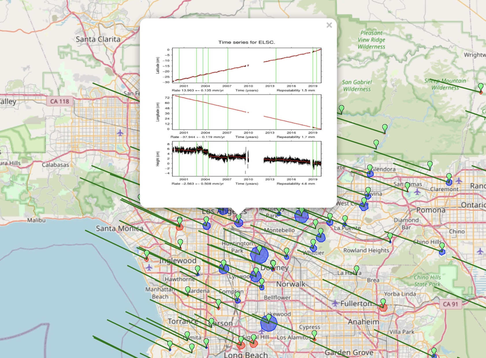

# Leaflet KML layer plugin (custom-build)

This plugin was forked from [windycom/leaflet-kml](https://github.com/windycom/leaflet-kml).  
It is hardcoded to handle the KMLs generated from various internal services.      

## Licence

MIT
